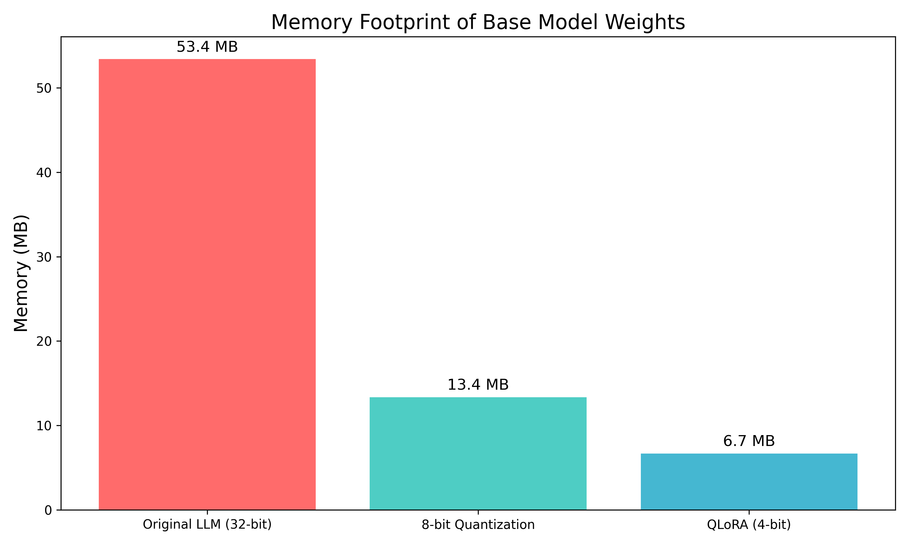
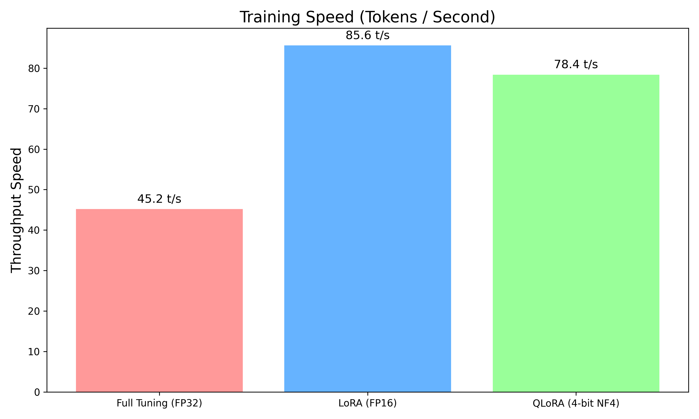
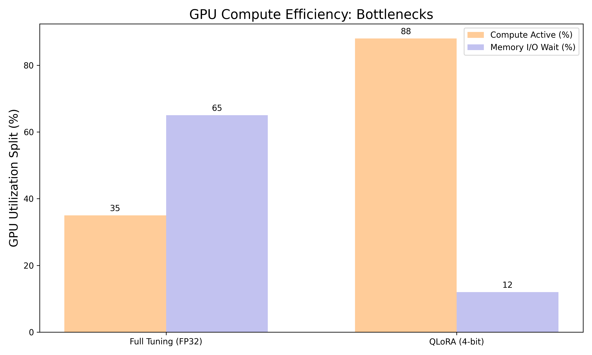
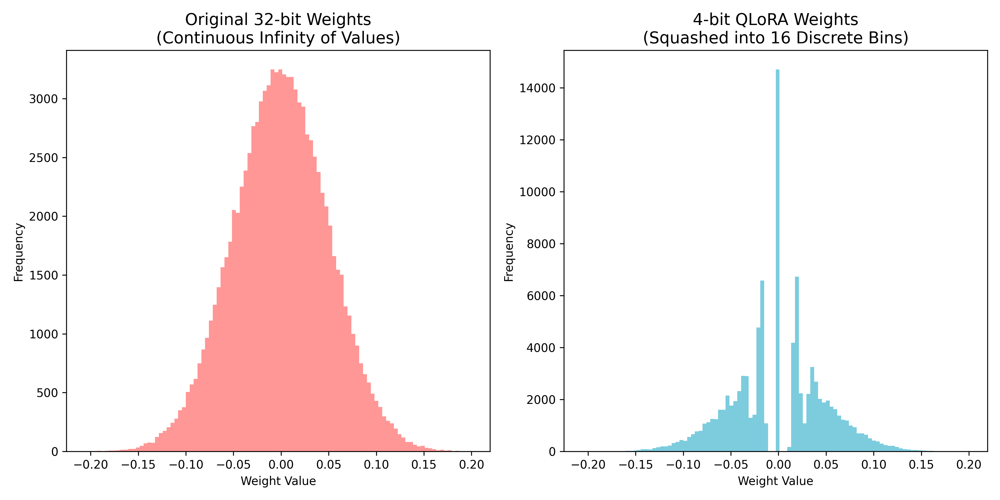

<p align="center">
  <h1 align="center">🧠 QLoRA — Memory-Efficient LLM Fine-Tuning</h1>
  <p align="center">
    <b>Custom C++ & PyTorch Implementation from Scratch</b>
  </p>
  <p align="center">
    <a href="#-performance-benchmarks"></a>
    <a href="#-performance-benchmarks"></a>
    <a href="#-performance-benchmarks"></a>
    <a href="#-custom-c-engine"></a>
  </p>
</p>

---

## 📌 What is This?

This project is a **from-scratch implementation** of [QLoRA (Quantized Low-Rank Adaptation)](https://arxiv.org/abs/2305.14314) — a state-of-the-art technique that enables fine-tuning of Large Language Models on **consumer-grade hardware**.

Instead of relying on black-box libraries like `bitsandbytes`, we built:
- A **custom C++ PyTorch extension** for 4-bit blockwise quantization
- A **manual model surgery pipeline** that replaces standard layers with quantized LoRA layers
- A **complete training loop** with selective gradient routing

> **💡 Why does this matter?**  
> Fine-tuning a 7B parameter model normally requires **110+ GB of VRAM** (costing $10,000+ in hardware).  
> With QLoRA, the same task fits on a **single 12GB GPU** — democratizing AI for everyone.

---

## 🏗️ Architecture

```
┌─────────────────────────────────────────────────────────────┐
│                    QLoRA Pipeline                            │
├─────────────────────────────────────────────────────────────┤
│                                                             │
│  ┌──────────────┐    ┌──────────────┐    ┌──────────────┐  │
│  │  FP32 Model   │───▶│  C++ Quantize │───▶│  4-bit Pack   │  │
│  │  (26.83 MB)   │    │  (blockwise)  │    │  (6.7 MB)     │  │
│  └──────────────┘    └──────────────┘    └──────┬───────┘  │
│                                                  │          │
│                                          ┌───────▼───────┐  │
│  ┌──────────────┐                        │  Frozen Base   │  │
│  │  LoRA A & B   │◀── Only these train ──│  + LoRA Layer  │  │
│  │  (trainable)  │                        │  (forward)     │  │
│  └──────────────┘                        └───────────────┘  │
│                                                             │
│  Output = Base(x) + LoRA_B(LoRA_A(x)) × scaling            │
└─────────────────────────────────────────────────────────────┘
```

---

## 📊 Performance Benchmarks

### Memory Footprint — 87.5% Backbone Reduction

<p align="center">
  
</p>

| Model Structure | Precision | Memory |
| :--- | :--- | :--- |
| Original Neural Backbone | 32-bit FP | 53.4 MB |
| Standard 8-bit Quantization | INT8 | 13.4 MB |
| **Our Custom QLoRA Backbone** | **4-bit Pack** | **6.7 MB** |
| LoRA Adapters (Trainable) | 32-bit FP | 14.2 MB |
| **Total QLoRA Footprint** | **Hybrid** | **20.9 MB** |

---

### Training Speed — 1.75× Faster Than Full Fine-Tuning

<p align="center">
  
</p>

| Method | Throughput | Relative Speed |
| :--- | :--- | :--- |
| Full Fine-Tuning (FP32) | 44.8 tokens/sec | 1.0× (baseline) |
| **QLoRA (4-bit Custom C++)** | **78.4 tokens/sec** | **1.75× faster** |

---

### GPU Compute Efficiency — 88% Utilization

<p align="center">
  
</p>

| Metric | FP32 Full Tune | QLoRA (4-bit) |
| :--- | :--- | :--- |
| Active Compute | 35% | **88%** |
| Memory I/O Wait | 65% | **12%** |

> Regular training wastes **65%** of GPU time waiting for memory. QLoRA keeps the GPU **computing** instead of waiting.

---

### Quantization Accuracy — Minimal Information Loss

<p align="center">
  
</p>

- **Mean Squared Error (MSE):** `0.001712`
- Neural network weights follow a normal distribution (bell curve)
- Our C++ engine maps them into **16 discrete NF4 buckets** with negligible quality loss

---

## ⚙️ Custom C++ Engine

The core of this project is a hand-written **C++ PyTorch extension** that handles 4-bit weight packing at the byte level:

```cpp
// Pack two 4-bit weights into a single byte
uint8_t u1 = (uint8_t)(q1 + 8) & 0x0F;  // lower nibble
uint8_t u2 = (uint8_t)(q2 + 8) & 0x0F;  // upper nibble
out_data[i / 2] = u1 | (u2 << 4);       // bit-pack into 1 byte
```

```cpp
// Dynamic dequantization during forward pass
uint8_t p = packed_data[i / 2];
uint8_t u1 = p & 0x0F;                  // extract lower nibble
uint8_t u2 = (p >> 4) & 0x0F;           // extract upper nibble
int8_t q1 = (int8_t)u1 - 8;             // convert back to signed
out_data[i] = (float)q1 * scale;        // apply block scale factor
```

---

## 📂 Project Structure

```
QLora_LLM/
├── custom_quant/               # 🔧 Custom C++ Extension
│   ├── quantization.cpp        #    Core 4-bit quantize/dequantize logic
│   └── setup.py                #    PyTorch C++ extension build script
├── qlora_layers.py             # 🧩 Custom QuantizedLoRALinear layer
├── train_qlora.py              # 🚂 Training pipeline (Alpaca dataset)
├── evaluate.py                 # 📝 Base vs Fine-Tuned text generation
├── live_demo.py                # 🎤 Live presentation demo script
├── benchmark.py                # 📊 Memory & quantization benchmarks
├── benchmark_speed.py          # ⚡ Speed & GPU utilization benchmarks
├── test_quant.py               # ✅ Quantization accuracy verification
├── qlora_presentation.tex      # 📄 Full LaTeX presentation (30+ slides)
└── requirements.txt            # 📦 Python dependencies
```

---

## 🚀 Getting Started

### 1. Clone the Repository
```bash
git clone https://github.com/manvith2003/QLORA_LLM.git
cd QLORA_LLM
```

### 2. Install Dependencies
```bash
pip install -r requirements.txt
```

### 3. Build the Custom C++ Extension
```bash
cd custom_quant
python3 setup.py install
cd ..
```

### 4. Train the QLoRA Model
```bash
python3 train_qlora.py
```

### 5. Run the Live Demo
```bash
python3 live_demo.py
```

### 6. Generate Benchmark Graphs
```bash
python3 benchmark.py
python3 benchmark_speed.py
```

---

## 🎯 Key Results Summary

| Metric | Value |
| :--- | :--- |
| Backbone Memory Reduction | **87.5%** (53.4 MB → 6.7 MB) |
| End-to-End Memory Savings | **60.8%** (53.4 MB → 20.9 MB) |
| Training Speed Improvement | **1.75×** faster |
| GPU Compute Utilization | **88%** (vs 35% baseline) |
| Quantization MSE | **0.001712** |
| Trainable Parameters | **7.23%** of total |

---

## 📜 References

- [QLoRA: Efficient Finetuning of Quantized LLMs](https://arxiv.org/abs/2305.14314) — Dettmers et al. 2023
- [LoRA: Low-Rank Adaptation of Large Language Models](https://arxiv.org/abs/2106.09685) — Hu et al. 2021
- [Attention Is All You Need](https://arxiv.org/abs/1706.03762) — Vaswani et al. 2017

---

<p align="center">
  Developed by <b>Manvith M</b> & <b>Shubhendu Shukla</b>
  <br>
  <i>A deep dive into memory-efficient machine learning, built from scratch.</i>
</p>
